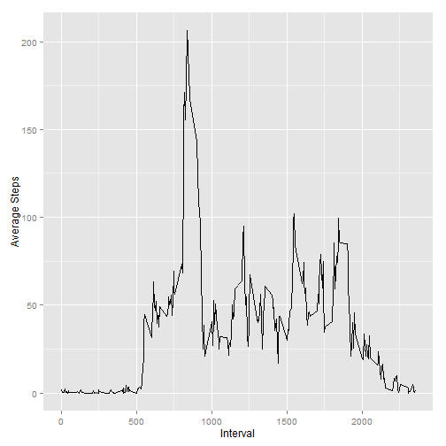

# Reproducible Research: Peer Assessment 1

# Load data into R

```r
activity <- read.csv("activity.csv")
```

## Process/transform the data
### Create summary table 'daily_activity' with calculation of number steps taken on each day. 
I have elected to ignore NAs so as not to lose days that have NAs in them. Unfortunately this results in days which hve all NAs being reported as having 0 steps (rather than NA steps) and thereby biasing the mean, median and changing the look of the histogram

```r
daily_activity <- aggregate(activity$steps, list(activity$date), sum, na.rm=T)
names(daily_activity)<-c("date", "steps")
```

### Create summary table 'interval_activity' with calculation of average number steps taken in each time interval across all days

```r
interval_activity <- aggregate(activity$steps, list(activity$interval), mean, na.rm=T)
names(interval_activity)<-c("interval", "steps")
```

## What is mean total number of steps taken per day?
### Make a histogram of the total number of steps taken each day

```r
library (ggplot2)
qplot(daily_activity$steps, geom="histogram", binwidth = 1000, xlab = "Steps", ylab = "Frequency")
```

 

### Calculate and report the mean and median total number of steps taken per day

```r
step_mean <- mean(daily_activity$steps, na.rm=T)
step_mean
```

```
## [1] 9354
```

```r
step_median <- median(daily_activity$steps, na.rm=T)
step_median
```

```
## [1] 10395
```


## What is the average daily activity pattern?
### Make a time series plot of the 5-minute interval (x-axis) and the average number of steps taken, averaged across all days (y-axis)

```r
qplot(interval_activity$interval, interval_activity$steps, geom="line", xlab = "Interval", ylab = "Average Steps")
```

 

### Which 5-minute interval, on average across all the days in the dataset, contains the maximum number of steps?

```r
interval_activity$interval [interval_activity$steps==max(interval_activity$steps, na.rm = T)]
```

```
## [1] 835
```

## Imputing missing values
### Calculate and report the total number of missing values in the dataset (i.e. the total number of rows with NAs)

```r
rows_with_na <- activity[is.na(activity[,]),]
dim(rows_with_na)[1]
```

```
## [1] 2304
```

### Create a new dataset that is equal to the original dataset but with the missing data filled in.

```r
#Make copy of activity dataset
activity_no_na <- activity

#Mark rows as containing NA or not
activity_na_bool<-is.na(activity_no_na$steps)

#Update NA values in 'steps' column so the values are set to the mean for that interval across all non-NA values
activity_no_na$steps[activity_na_bool] <- interval_activity$steps[match(activity_no_na$interval[activity_na_bool], interval_activity$interval)]
```

### Create updated summary table 'daily_activity_no_na' with calculation of number steps taken on each day

```r
daily_activity_no_na <- aggregate(activity_no_na$steps, list(activity_no_na$date), sum, na.rm=T)
names(daily_activity_no_na)<-c("date", "steps")
```

### With the updated data - make a histogram of the total number of steps taken each day

```r
qplot(daily_activity_no_na$steps, geom="histogram", binwidth = 1000, xlab = "Steps", ylab = "Frequency")
```

 

### With the updated data - Calculate and report the mean and median total number of steps taken per day

```r
step_mean_no_na <- mean(daily_activity_no_na$steps, na.rm=T)
step_mean_no_na
```

```
## [1] 10766
```

```r
step_median_no_na <- median(daily_activity_no_na$steps, na.rm=T)
step_median_no_na
```

```
## [1] 10766
```

### Do these values differ from the estimates from the first part of the assignment? What is the impact of imputing missing data on the estimates of the total daily number of steps?
Both the mean and median increased significantly and the histogram shifted right as days that previously had no steps (due to a large number of NAs) became days with over 10,000 steps (the total of all the mean interval step values)

## Are there differences in activity patterns between weekdays and weekends?

### Add and populate 'weekday_weekend' column to the activity_no_na dataset

```r
#Add new column - make all values "weekend"
activity_no_na$weekday_weekend <- "weekend"

#Find weekdays
activity_no_na_weekdays <- as.POSIXlt(activity_no_na$date)$wday %in% 1:5

#Label weekdays
activity_no_na$weekday_weekend[activity_no_na_weekdays] <- "weekday"

#Convert column to factor
activity_no_na$weekday_weekend <- as.factor(activity_no_na$weekday_weekend)
```

### Create updated summary table 'interval_activity_no_na' - split by weekday_weekend

```r
interval_activity_no_na <- aggregate(activity_no_na$steps, by = list(activity_no_na$interval, activity_no_na$weekday_weekend), mean, na.rm=T)
names(interval_activity_no_na)<-c("interval", "weekday_weekend", "steps")
```

### Compare weekdays and weekends

```r
#Make side by side plots for weekday/weekend
qplot(interval, steps, geom="line", xlab = "Interval", ylab = "Number of steps", data = interval_activity_no_na, facets = weekday_weekend ~ .)
```

 
